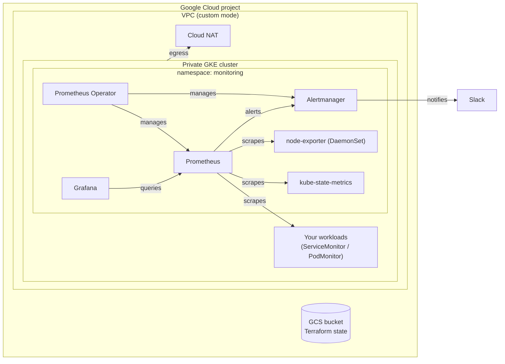

# Prometheus Operator Setup

[](https://github.com/hermeto/prometheus-operator-setup/actions/workflows/ci.yml)
[](https://github.com/hermeto/prometheus-operator-setup/actions/workflows/e2e.yml)

Production-grade Kubernetes monitoring as code: a private, hardened GKE cluster and the
[kube-prometheus-stack](https://github.com/prometheus-community/helm-charts/tree/main/charts/kube-prometheus-stack)
(Prometheus Operator, Prometheus, Alertmanager, Grafana, kube-state-metrics, node-exporter), deployed with Terraform.
The same monitoring module runs on a local [kind](https://kind.sigs.k8s.io/) cluster, so the whole project can be run
and tested end to end without a cloud account.

## What you get

| Area | Highlights |
| --- | --- |
| **GKE** | Private nodes, control plane restricted to authorized networks, no static credentials, Workload Identity, Shielded Nodes, Dataplane V2 (network policy), dedicated least-privilege node service account, release channel and maintenance window, autoscaling, optional Spot VMs, deletion protection. |
| **Network** | Custom VPC, VPC-native secondary ranges, Cloud NAT, firewall limited to the VPC's own ranges (no `0.0.0.0/0`), optional IAP SSH, flow logs. |
| **Monitoring** | Pinned charts, CRDs upgraded through their own release, persistent storage with retention by time and size, `cluster` external label, cluster-wide discovery of ServiceMonitors/PodMonitors/rules, GKE-aware scrape targets (no permanently-down control plane targets). |
| **Alerting** | Slack receiver with the webhook read from a Secret, severity inhibition, `Watchdog` routed to a null receiver, runbook links. |
| **As code** | Prometheus rules with `promtool` unit tests, Grafana dashboards provisioned from JSON, an instrumented sample application. |
| **Security** | Secrets never in Git, Helm values or plan output; state in a versioned GCS bucket; `trivy`, `tflint` and `gitleaks` in CI and pre-commit. |
| **Delivery** | `make check` runs every static test; `make e2e` deploys on kind and smoke-tests the full pipeline; GitHub Actions run both on every pull request; Renovate keeps versions current. |

## Architecture



Terraform is split in two stacks with separate states, so a broken Helm release can never block or destroy infrastructure:

| Stack | Path | Creates |
| --- | --- | --- |
| platform | [`terraform/environments/gcp/platform`](terraform/environments/gcp/platform) | Project APIs, network, GKE cluster |
| monitoring | [`terraform/environments/gcp/monitoring`](terraform/environments/gcp/monitoring) | Monitoring stack on that cluster |
| local | [`terraform/environments/local`](terraform/environments/local) | Monitoring stack on kind |

More detail in [docs/architecture.md](docs/architecture.md).

## Repository layout

```text
.
├── terraform/
│   ├── modules/
│   │   ├── network/        VPC, subnet, NAT, firewall         (+ tests/)
│   │   ├── gke/            private GKE cluster and node pool  (+ tests/)
│   │   └── monitoring/     kube-prometheus-stack, secrets, dashboards (+ tests/, values/base.yaml)
│   ├── environments/
│   │   ├── local/          kind
│   │   └── gcp/{platform,monitoring}/
│   └── tests/render-values/  test helper that exports the Helm values
├── monitoring/
│   ├── rules/              Prometheus rules (deployed to every environment)
│   ├── tests/              promtool unit tests for the rules
│   └── dashboards/         Grafana dashboards (JSON)
├── examples/sample-app/    instrumented app + ServiceMonitor
├── kind/cluster.yaml       local cluster definition
├── scripts/                smoke tests, Alertmanager config check
├── docs/                   architecture, operations, runbooks
└── Makefile                every workflow: `make help`
```

## Requirements

| Tool | Version | Used for |
| --- | --- | --- |
| [Terraform](https://developer.hashicorp.com/terraform/install) | >= 1.9 (CI uses 1.16) | everything |
| [kubectl](https://kubernetes.io/docs/tasks/tools/) | any recent | deploy and smoke tests |
| [Docker](https://docs.docker.com/get-docker/) | any recent | kind, `promtool`, `amtool` |
| [kind](https://kind.sigs.k8s.io/docs/user/quick-start/#installation) | >= 0.33 | local environment |
| [Helm](https://helm.sh/docs/intro/install/) | 3.x | `make test-helm` |
| [tflint](https://github.com/terraform-linters/tflint), [kubeconform](https://github.com/yannh/kubeconform), [trivy](https://trivy.dev/), [shellcheck](https://www.shellcheck.net/), `jq` | latest | static checks |
| [gcloud](https://cloud.google.com/sdk/docs/install) | latest | GKE only |

`make tools` reports what is missing.

## Quick start: local (kind)

```bash
make e2e        # create kind, deploy the stack + sample app with Terraform, run the smoke tests
make grafana    # print the admin credentials and port-forward Grafana to http://localhost:3000
make local-down # delete everything
```

The smoke tests ([`scripts/smoke-test.sh`](scripts/smoke-test.sh)) prove the whole pipeline works, not just that
pods are running: every scrape target is up, the sample app is discovered through its ServiceMonitor, its rules are
loaded, Alertmanager receives alerts from Prometheus, and Grafana's data source and dashboards work.

Other UIs:

```bash
kubectl -n monitoring port-forward svc/kps-prometheus 9090:9090
kubectl -n monitoring port-forward svc/kps-alertmanager 9093:9093
```

## Deploy to Google Cloud (GKE)

1. **Authenticate** with Application Default Credentials (no service-account key files):

   ```bash
   gcloud auth login
   gcloud auth application-default login
   ```

2. **Create a state bucket** once, with versioning:

   ```bash
   gcloud storage buckets create gs://<state-bucket> --location=us-central1 --uniform-bucket-level-access
   gcloud storage buckets update gs://<state-bucket> --versioning
   ```

3. **Configure both stacks** — copy the examples and fill them in:

   ```bash
   for s in platform monitoring; do
     cp terraform/environments/gcp/$s/backend.hcl.example      terraform/environments/gcp/$s/backend.hcl
     cp terraform/environments/gcp/$s/terraform.tfvars.example terraform/environments/gcp/$s/terraform.tfvars
   done
   ```

   Set `master_authorized_networks` to the IPs that may reach the Kubernetes API (`curl -s ifconfig.me`).
   Both files are git-ignored.

4. **Create the platform**, then the monitoring stack:

   ```bash
   make gcp-platform-plan   && make gcp-platform-apply
   make gcp-credentials     # kubeconfig entry via gcloud
   export TF_VAR_alertmanager_slack_webhook_url='https://hooks.slack.com/services/...'   # optional
   make gcp-monitoring-plan && make gcp-monitoring-apply
   make gcp-smoke
   ```

5. **Tear down**: set `deletion_protection = false` in the platform `terraform.tfvars`, apply it, then `make gcp-destroy`.

Cost, access to the UIs, upgrades and troubleshooting: [docs/operations.md](docs/operations.md).

## Testing

| Command | What it proves | Needs |
| --- | --- | --- |
| `make fmt-check validate` | Terraform is formatted and valid | Terraform |
| `make lint` | tflint (Terraform + Google rulesets) | tflint |
| `make test-unit` | 41 `terraform test` cases with mocked providers: security baseline, wiring, validation, secrets never in Helm values | Terraform |
| `make test-rules` | `promtool` checks and unit-tests every alert | Docker |
| `make test-dashboards` | Dashboards are valid JSON with unique uids | jq |
| `make test-helm` | The real chart renders with the exact values Terraform passes; every manifest (CRDs included) passes `kubeconform`; the generated Alertmanager config passes `amtool` | Terraform, Helm, kubeconform, Docker |
| `make test-scripts` | shellcheck | shellcheck |
| `make security` | trivy misconfiguration scan | trivy |
| `make check` | all of the above (what CI runs) | |
| `make e2e` | full deployment on kind + smoke tests | kind, Docker |

## Customizing

- **Monitor a service**: add a `ServiceMonitor` or `PodMonitor` next to it, in any namespace — see
  [`examples/sample-app`](examples/sample-app/sample-app.yaml).
- **Add alerts**: drop a `*.rules.yaml` file in [`monitoring/rules`](monitoring/rules) and a unit test in
  [`monitoring/tests`](monitoring/tests); add a section to [docs/runbooks.md](docs/runbooks.md).
- **Add dashboards**: export the JSON from Grafana into [`monitoring/dashboards`](monitoring/dashboards).
- **Tune the stack**: edit the environment's `values.yaml`; module defaults are in
  [`values/base.yaml`](terraform/modules/monitoring/values/base.yaml).

## Contributing

See [CONTRIBUTING.md](CONTRIBUTING.md). Security issues: [SECURITY.md](SECURITY.md). Changes: [CHANGELOG.md](CHANGELOG.md).

## License

[MIT](LICENSE) © Hermeto Romano
