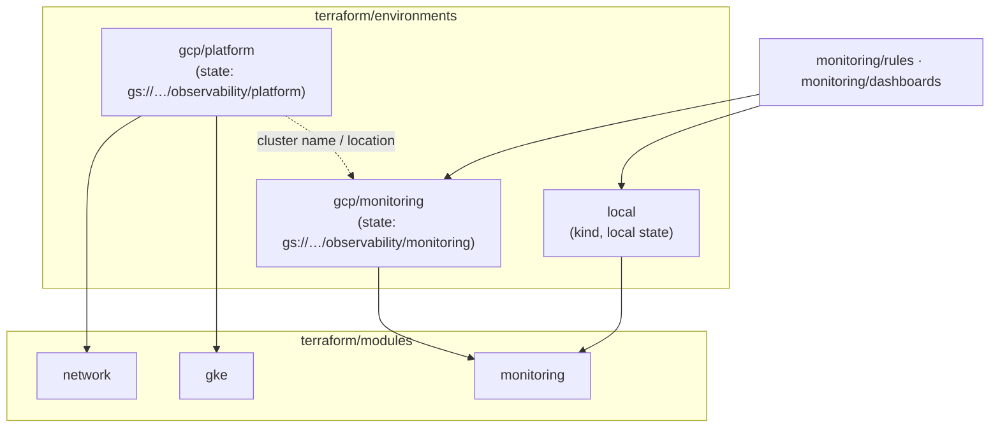
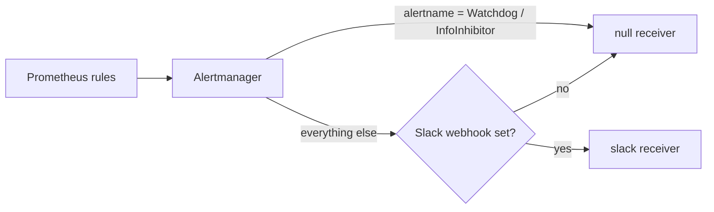
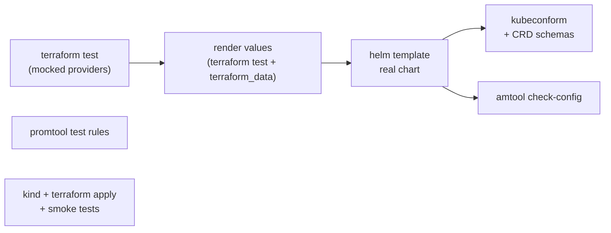

# Architecture

## Goals

1. **Reproducible**: every resource is declared in Terraform, every version is pinned, and every environment is
   created from the same modules.
2. **Secure by default**: nothing is reachable from the internet unless you allow it, and no credential is stored
   in Git, in Helm values or in a kubeconfig file.
3. **Testable without a cloud account**: the logic is covered by unit tests with mocked providers, the chart is
   rendered with the exact values Terraform generates, and the full stack runs on kind.

## Layers

### Why two GCP stacks

The `kubernetes` and `helm` providers need a reachable cluster when they are configured. If the cluster and the
Helm releases share a state, every plan depends on the cluster, a provider misconfiguration blocks infrastructure
changes, and replacing the cluster tries to talk to a cluster that no longer exists. With separate states:

- `platform` only talks to the Google APIs;
- `monitoring` looks the cluster up with a data source and authenticates with the caller's short-lived OAuth token
  (`google_client_config`); no kubeconfig or client certificate is ever written.

### Network

| Range | Default | Purpose |
| --- | --- | --- |
| Subnet primary | `10.10.0.0/20` | Nodes |
| Secondary `pods` | `10.20.0.0/16` | Pod IPs (VPC-native) |
| Secondary `services` | `10.30.0.0/20` | Service IPs |
| Control plane | `172.16.0.0/28` | Private endpoint peering |

Nodes have no public IP; Cloud NAT gives them egress (container registries). The only firewall rule GKE does not
manage itself admits traffic from these ranges. SSH is off unless `enable_iap_ssh = true`, and then only from
Google's IAP range.

### Cluster

- **Access**: the control plane endpoint is public but restricted to `master_authorized_networks`
  (`enable_private_endpoint = true` removes the public endpoint entirely and requires a bastion or VPN). Basic auth
  and client certificates are disabled; access is IAM + RBAC.
- **Identity**: nodes run as a dedicated service account with logging/monitoring writer roles only. Workloads use
  Workload Identity (`GKE_METADATA`), so the node identity is never exposed to Pods.
- **Upgrades**: a release channel (default `REGULAR`) inside a daily maintenance window; node pools surge-upgrade
  with `max_unavailable = 0`.
- **Monitoring**: Cloud Monitoring keeps system components only; Google Managed Prometheus is disabled to avoid
  paying twice for the same metrics.

### Monitoring stack

| Component | Name | Notes |
| --- | --- | --- |
| CRDs | release `prometheus-operator-crds` | Installed and upgraded separately; Helm never upgrades CRDs in `crds/`. |
| Operator | `deployment/kps-operator` | Reconciles Prometheus, Alertmanager and the monitoring CRs. |
| Prometheus | `prometheus/kps-prometheus` | PVC (`standard-rwo` on GKE), retention by time and size, `cluster` external label. Selects monitors and rules in every namespace. |
| Alertmanager | `alertmanager/kps-alertmanager` | Config generated by Terraform; Slack webhook mounted from the `alertmanager-slack` Secret. |
| Grafana | `deployment/grafana` | Admin credentials from the `grafana-admin` Secret; dashboards loaded by the sidecar from labelled ConfigMaps; no PVC (dashboards are code). |
| kube-state-metrics, node-exporter | | Cluster object and node metrics. |

Scrape targets are environment-aware. On GKE the control plane (`kube-controller-manager`, `kube-scheduler`,
`etcd`) is managed by Google and cannot be scraped, kube-proxy does not exist with Dataplane V2, and DNS is
kube-dns rather than CoreDNS. Scraping them anyway would leave `TargetDown` alerts firing forever, so they are
switched accordingly.

### Alert routing

Inhibition: a `critical` alert mutes `warning`/`info` alerts with the same `alertname` and `namespace`, a `warning`
mutes `info`, and `InfoInhibitor` mutes `info` alerts in its namespace.

## Secrets

| Secret | Where it comes from | Where it lives |
| --- | --- | --- |
| GCP credentials | `gcloud auth application-default login` or Workload Identity Federation in CI | Never in the repository |
| Kubernetes access | Short-lived OAuth token from ADC | Memory of the Terraform run |
| Grafana admin password | `random_password` (or `grafana_admin_password`) | Secret `monitoring/grafana-admin` |
| Slack webhook | `TF_VAR_alertmanager_slack_webhook_url` | Secret `monitoring/alertmanager-slack` |

Terraform state contains the generated values, so the state bucket must be private, versioned and, ideally,
encrypted with a customer-managed key. The module tests assert that no secret is ever written to the Helm values.

## Tests

`terraform/tests/render-values` is a tiny helper module used from the environments' `tests/render.tftest.hcl`: it
writes the values documents Terraform would pass to Helm into `build/values/<env>/`, so the chart is validated with
exactly what would be deployed.
